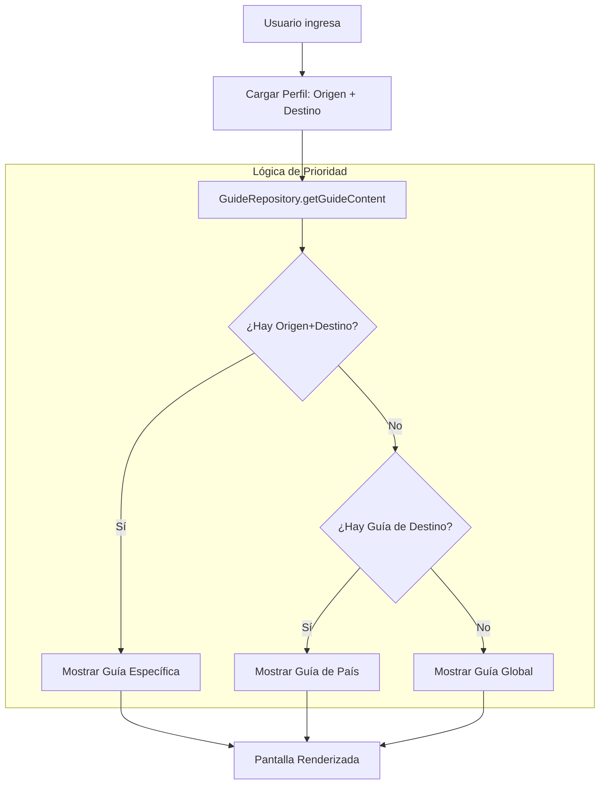

# Documentación Técnica y Arquitectura - ExpaIO

Esta guía detalla el funcionamiento interno de ExpaIO para desarrolladores y equipo técnico.

## 1. Modelo de Datos (PostgreSQL / Supabase)

La base de datos está diseñada para ser escalable y soportar múltiples idiomas y combinaciones de países.

### Tablas Principales

- **`paises`**: Catálogo de destinos y orígenes. Incluye `codigo` (ISO), `moneda` y `simbolo`.
- **`perfiles`**: Extensión de `auth.users`. Almacena la ruta crítica del usuario: `pais_origen_id` y `pais_destino_id`.
- **`guias_paises`**: El motor de contenido.
    - `pais_id`: Destino al que aplica.
    - `pais_origen_id`: (Opcional) Nacionalidad específica a la que aplica.
    - `UNIQUE(pais_id, pais_origen_id, tipo_guia)`: Asegura integridad de jerarquía.
- **`tareas_sugeridas`**: Plantillas para el checklist. Pueden filtrarse por destino u origen.
- **`user_checklists`**: Estado de completado de cada usuario para cada tarea.

---

## 2. Lógica de Inteligencia de Negocio

### Puente Origen-Destino (Nationality Awareness)
El asesoramiento migratorio depende de quién eres y a dónde vas.
- **AI Context**: `GeminiService` recibe el nombre de ambos países e inyecta esto en el `contextualPrompt`. Esto permite que Gemini responda sobre visas y convenios bilaterales específicos.
- **Prioridad de Carga (Waterfall)**:
    1.  Específico: Guía que coincide con `origen` + `destino`.
    2.  General: Guía que coincide solo con `destino` (origen es NULL).
    3.  Mundial: Guía GLOBAL (destino es NULL).

---

## 3. Servicios e Integraciones

### Asistente IA (GeminiService.ts)
- **Modelo**: `gemini-1.5-flash` para balancear velocidad y razonamiento.
- **Streaming**: Implementado vía generadores asíncronos (`AsyncGenerator`) para mejorar la percepción de velocidad en la UI (UX tipo WhatsApp).
- **Control de Sesión**: Se usa `startChat` para mantener el historial durante la sesión de navegación.

### Repositorios (Patrón Repository)
Separamos la lógica de Supabase en archivos dedicados (`src/api/repositories/`):
- `ProfileRepository`: CRUD de perfiles.
- `GuideRepository`: Lógica compleja de jerarquía de guías.
- `ChecklistRepository`: Gestión de tareas y persistencia.

---

## 4. Flujo de Onboarding Técnico

1.  **Forks/Branches**: Crea una rama por feature.
2.  **Base de Datos**: Los cambios en el esquema DEBEN reflejarse en `supabase_setup.sql`.
3.  **Tipado**: Siempre define los tipos en `src/types/index.ts` antes de implementar el repositorio.
4.  **Componentes**: Usa el diseño de `InitialGuideScreen.tsx` como referencia para nuevas pantallas dinámicas.

---

## 5. Diagrama de Flujo: Carga de Información Personalizada

