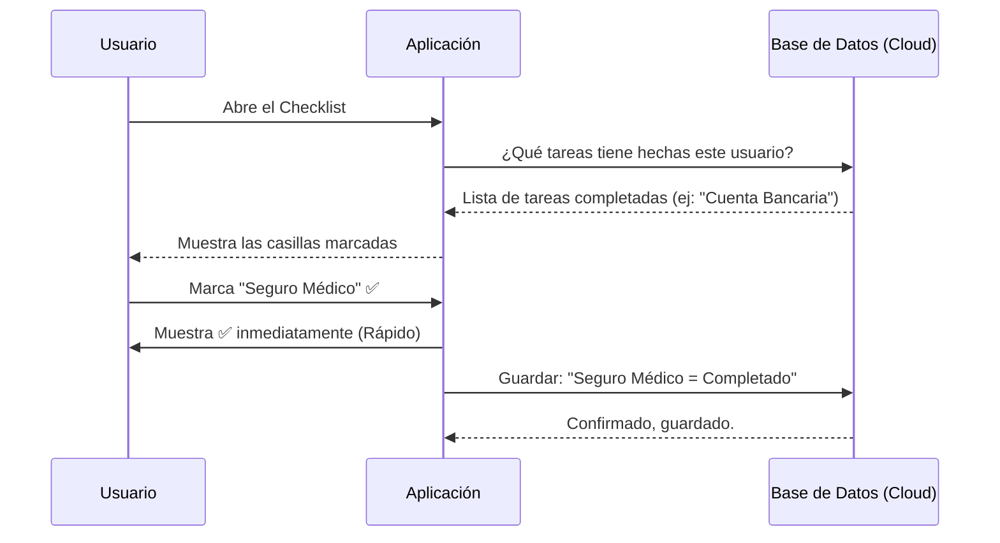
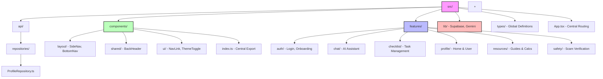

# ExpaIO - Documentación del Proyecto

## 1. Introducción
**ExpaIO** es una aplicación web diseñada para ayudar a las personas que acaban de mudarse a Suiza (o planean hacerlo). Su misión es simplificar la burocracia y la integración mediante herramientas fáciles de usar y un asistente inteligente.

## 2. Funcionalidades Clave

### 🔐 Login y Registro Fácil
- **Qué hace**: Permite a los usuarios crear una cuenta segura con su correo electrónico.
- **Para qué sirve**: Para guardar tu progreso (checklist), tus datos personales y tu historial de chats, para que no se pierdan si cierras el navegador.

### ✅ Checklist Interactivo
- **Qué hace**: Una lista de tareas inteligente dividida en "Planificación" (antes de ir) y "Llegada" (ya en Suiza).
- **Para qué sirve**: Te guía paso a paso en trámites como "Abrir cuenta bancaria", "Seguro médico" o "Permiso de residencia".
- **Inteligencia**: Se sincroniza automáticamente con la "nube" (base de datos). Si marcas una tarea en tu móvil, aparecerá marcada en tu ordenador.

### 🤖 Asistente IA (ExpaIO Bot)
- **Qué hace**: Un chat donde puedes preguntar cualquier duda sobre vivir en Suiza (en español).
- **Para qué sirve**: Responde preguntas complejas como "¿Cómo funciona el seguro médico?" o "¿Qué es la Quellensteuer?" al instante, sin tener que buscar en Google por horas.

### 📚 Centro de Recursos
- **Qué hace**: Guías rápidas sobre trabajo, vivienda, seguros y transporte.
- **Para qué sirve**: Información verificada y directa al grano.

---

## 3. ¿Cómo está construido? (Tecnología)

Imagina que la aplicación es como un restaurante:

1.  **La Fachada (Frontend - React + Vite)**:
    - Es lo que tú ves y tocas (los botones, los colores, las animaciones).
    - Está hecho con tecnología moderna para que sea ultra-rápido y funcione bien en móviles.

2.  **El Almacén (Backend - Supabase)**:
    - Es donde se guardan los "ingredientes": tus datos de usuario, qué tareas has completado y quién eres.
    - Es seguro y privado. Nadie más puede ver tus datos.

3.  **El Chef Experto (IA - Google Gemini)**:
    - Es el cerebro detrás del chat.
    - Usamos un modelo avanzado de Google (`gemini-2.5-flash`) entrenado para entender y responder en español con empatía.

---

## 4. Flujos de Usuario (Diagramas)

### A. Flujo de Registro (Entrar a la App)
Este diagrama muestra qué pasa cuando un usuario nuevo se registra.

```mermaid
graph LR
    User((Usuario)) -->|1. Introduce Email/Pass| App[Aplicación ExpaIO]
    App -->|2. Envía datos| Supabase[Base de Datos (Supabase)]
    Supabase -->|3. Verifica & Crea Usuario| Supabase
    Supabase -->|4. Crea Perfil Vacío| DB[(Tabla Perfiles)]
    Supabase -->|5. Confirma Login| App
    App -->|6. Muestra Home| User
    style App fill:#e1f5fe,stroke:#01579b
    style Supabase fill:#e8f5e9,stroke:#2e7d32
```

### B. Flujo del Checklist (Guardar Progreso)
Cómo se guarda tu progreso para que no se pierda.



### C. Flujo del Chat con IA
Cómo funciona la magia del asistente.

```mermaid
graph TD
    User[Usuario Pregunta: \n"¿Qué es la 'Lamal'?"] -->|Envía Texto| App
    App -->|Añade contexto: \n"Responde en español, sé amable..."| AI[Cerebro IA (Google Gemini)]
    
    subgraph "Proceso de Pensamiento"
    AI -->|Piensa| Thinking[Analiza la pregunta]
    Thinking -->|Redacta| Response[Genera respuesta sobre Seguro Médico]
    end
    
    AI -->|Envía Respuesta| App
    App -->|Muestra Texto| User
    
    style AI fill:#f3e5f5,stroke:#7b1fa2
```

---

## 5. Resumen Técnico para el Equipo
(Si algún programador entra al proyecto en el futuro)

- **Repositorio**: GitHub (control de versiones).
- **Base de Datos**: PostgreSQL (gestionado por Supabase).
- **Tablas**:
    - `profiles`: Datos del usuario.
    - `user_checklists`: Estado de tareas.
    - `chatbots` / `messages`: Historial de chat.
- **Inteligencia Artificial**: Google Generative AI SDK (`@google/generative-ai`).
- **Autenticación**: Supabase Auth (Email/Password).
- **Estilos**: TailwindCSS (vía CDN/CSS puro) y CSS Modules.


### Estructura de Arquitectura Feature-Sliced Design (Directorio `src/`)

